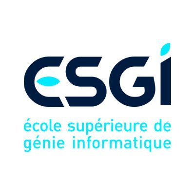

# Cahier des charges

## Présentation de notre entreprise

Nom de l’entreprise : LYLT

Nom du projet : LyltSign

Email : lylt@outlook.fr

<aside>
📍 Adresse : 53 Cours Albert thomas

</aside>

Hiérarchie : 

- Admin système et réseaux : **Allan VIEIRA**
- Consultant Technique et chef de projet : **Maxime LAI YIO LAI TONG**
- Consultant technique : **Ilias BAGHAGHA**
- Consutante technique : **Manelle HASSEN**

Personne à contacter dans l’entreprise : 

<aside>
📞 **LAI YIO LAI TONG Maxime** : 07.83.78.57.14                                                                                    **BAGHAGHA Ilias** : 07.71.17.94.50
**VIEIRA Allan** : 07.82.88.11.89
**HASSEN Manelle** : 07.69.35.79.25

</aside>

## Présentation de l’entreprise

Fondée en 1983 ESGI est une école qui forme de Bac à Bac+5 des professionnels de l’informatique, des systèmes d’information et du numérique. L'enseignement s'attache à la théorie (algorithmique, connaissance des langages de programmation, systèmes, architecture des réseaux, etc) et à la mise en pratique en situation professionnelle.

- Nombre de salariés

Possède une capacité de 2 200 étudiants ainsi que 50 + de salariés dans la structure

- Chiffre d’affaires annuel

Très peux d’informations parle de ce sujet mais nous nous basons sur une fourchette de 1.000.000€ à 1.500.000

- Capital

1.000€

- Valeurs véhiculées par l’entreprise

Responsabilité, intégrité, respect d'autrui, objectivité, loyauté et confiance

1. L'excellence : Elle met en avant la recherche de l'excellence académique, ainsi que l'excellence professionnelle et personnelle de ses étudiants.
2. L'innovation : L'école ESGI encourage l'innovation et la créativité de ses étudiants en les encourageant à développer de nouvelles idées et à trouver des solutions créatives aux problèmes.
3. L'ouverture : Celle-ci prône l'ouverture d'esprit, la diversité et l'inclusion, en encourageant la collaboration et l'échange entre étudiants de différentes cultures et horizons.
4. La responsabilité : Elle Sensibilise ses étudiants à l'impact de leurs actions sur la société et sur l'environnement, en les encourageant à adopter une attitude responsable et éthique.
5. La professionnalisation : ESGI vise à préparer ses étudiants à intégrer rapidement le monde professionnel, en leur fournissant les compétences techniques et transversales nécessaires pour réussir dans leur carrière.

.................................................................................................................................

Indiquez les produits et/ou services vendus (marques, gammes et lignes de produits…)

Développement d’application web

Analyse de l’existant :

De quel(s) système(s) de gestion de contrats avec les clients dispose actuellement votre entreprise ?

L’entreprise possède un système mis en place par l’OPCO Les missions principales des OPCO sont de collecter les fonds de la formation professionnelle, de financer les formations pour les salariés et les demandeurs d'emploi, de conseiller les entreprises sur les besoins en formation et de contribuer à l'évolution des métiers et des compétences

Quels sont les problèmes rencontrés actuellement ? 

Temps de gestion de fiche trop élevé le travail que prend la gestion administrative des fiches est énorme dans la journée, le discours est similaire que ce soit concernant les professeur et les l’administration, pour les élèves, il y a un impact conséquent sur les paies des élèves donc il y a une réel importance car il y a un certain niveau de confiance à accorder aux professeur. Il y a un réel problème d’organisation et de fiabilité de la part du processus de réalisation et d’optimisation. 

AP (imprime les feuilles et les déposent en salle des prof)→ intervenant (risque d’oublie feuille)→ élève (risque de fraude) → intervenant (risque d’oublie des présences)→ repographie (3-4h de sesie par jours) → Ataché de promo (saisie des absences) → Opco (qui récupère les feuilles et les contrôle présents ou pas vis-à vis des contrat)

## A.1. Les objectifs

Détaillez le ou les objectifs attendus avec cette nouvelle solution

- Améliorer l'efficacité de l'émargement : En utilisant un système d'émargement en ligne, la solution peut améliorer l'efficacité de la collecte des données de présence des élèves, tout en réduisant le temps consacré à l'émargement manuel.
- Renforcer la transparence et l'exactitude des données : Ce système d'émargement en ligne peut aider à renforcer la transparence et l'exactitude des données de présence des élèves. En fournissant des rapports d'émargement précis en temps réel, les enseignants et les responsables académiques peuvent mieux comprendre la participation des élèves et prendre des décisions éclairées.
- Faciliter la communication avec les entreprises (si alternance) : Le système d'émargement en ligne peuvent faciliter la communication avec les entreprises en fournissant des rapports de présence détaillés. Ainsi ils peuvent suivre la participation en temps réel, ce qui peut améliorer la collaboration entre les enseignants, les élèves et les tuteurs.
- Réduire la fraude académique : Ce système d'émargement en ligne peuvent aider à réduire la fraude académique en permettant de vérifier l'identité des élèves et en s'assurant qu'ils sont bien présents pendant les séances d’enseignement.
- Moderniser les pratiques d'émargement : La mise en place du système d'émargement en ligne peut aider à moderniser les pratiques d'émargement de votre école et améliorer son image en tant qu'établissement d'enseignement innovant et à la pointe de la technologie.

## A.2. Les cibles

Décrivez le profil des futurs utilisateurs de votre solution.

Ces derniers peuvent être internes et/ou externes à votre entreprise.

Décrivez au maximum vos cibles, leur âge, leurs habitudes...

Utilisateurs cible :

**Etudiant 19-25 ans**

**Intervenants enseignants ou professionnels 25-60 ans**

- Récupèrent la feuille d’appel en salle des profs avant chaque cours, la fait signer aux élèves durant le cours et la restitue à la reprographie
- 

[https://www.notion.so](https://www.notion.so)

**Administration 25/50 ans**

- Impriment la feuille d’appel la veille pour le lendemain et la place en salle des profs, de manière organisée pour faciliter la récupération.

**Reprographie 30/40 ans**

- Réceptionnent les feuilles d’appel après les intervenants, font 3/4h de saisi sur myges en récupérant le code sur la feuille. Scannent les feuilles et les envois à différents organismes.
- 

**Élèves à 18/30 ans**

- Signe la feuille d’appel au moment où le professeur la fait circuler(souvent en début de cours)

## LES CONCURRENTS

Indiquez vos principaux concurrents qu’ils utilisent ..

Notre concurrent principal sont les suivants :

- Edusign : Cette entreprise propose une plateforme en ligne sécurisée qui permet aux enseignants de signer numériquement les feuilles d'émargement et de collecter les signatures des étudiants. EduSign est conforme aux normes de sécurité et de confidentialité des données, notamment la RGPD.

- SignNow Education : SignNow est une entreprise américaine qui propose des solutions de signature électronique pour les établissements d'enseignement. SignNow Education permet aux enseignants de signer numériquement les feuilles d'émargement et de collecter les signatures des étudiants, ainsi que de gérer d'autres documents liés à l'éducation.

- Yousign : Entreprise française qui propose une solution de signature électronique pour les feuilles d'émargement dans le domaine de l'éducation. Cette solution permet aux enseignants de signer numériquement les feuilles d'émargement et de collecter les signatures des étudiants, tout en garantissant la conformité aux normes de sécurité et de confidentialité des données.

## DÉVELOPPEMENT DE L’APP

### C.1. Caractéristiques et fonctionnalités

**Solution qu’on souhaite développer ?**

<aside>
🖥️ Solution par abonnement (**SaaS**)

</aside>

Ce type de solution est louée par l’entreprise en contrepartie d’un abonnement au mois ou à l’année et utilisé via une application à distance ou une simple connexion internet.

Nous souhaitons développer une solution par abonnement, cela nous donne plusieurs avantages :

1. Évolutivité : Avec une solution SaaS, vous pouvez facilement ajouter ou supprimer des fonctionnalités selon les besoins de vos clients. Vous pouvez également adapter le service à l'évolution de la demande.
2. Facilité d'utilisation : Avec une solution SaaS, vos clients peuvent accéder à votre application web via un navigateur web sans avoir à installer de logiciel sur leur ordinateur. Cela facilite grandement l'utilisation de votre application, et permet à vos clients de travailler depuis n'importe où, à tout moment.
3. Économies d'échelle : En utilisant une solution SaaS, vous pouvez mutualiser les coûts d'infrastructure et de maintenance avec d'autres clients. Cela vous permet de réduire les coûts de développement, de mise à jour et de maintenance de votre application web.
4. Abonnement : Avec une solution SaaS, vous pouvez proposer un modèle d'abonnement mensuel ou annuel pour l'utilisation de votre application web. Cela vous permet de générer des revenus récurrents, tout en offrant à vos clients une solution souple et évolutive.
5. Sécurité : En utilisant une solution SaaS, vous pouvez garantir la sécurité de vos données grâce à des mesures de sécurité renforcées et à des sauvegardes régulières. Cela rassure vos clients et renforce leur confiance dans votre service.

**Nombre d’utilisateurs de la solution :**

<aside>
👥 Le nombre d’utilisateurs de notre solution pour sciences-u sera d’environ 2.500 utilisateurs.

</aside>

**Les fonctionnalités/modules attendus :**

Expression des besoins fonctionnels, avec une description détaillée (fonction conversationnelle, fonction de réservation en ligne, fonction d’achat en ligne, fonction de SAV en ligne, etc.)

1. Fonction d’émargement en ligne
2. Fonction d’archivage des fiches d’émargement
3. Fonction de justification des absences et retard
4. Fonction de consultation des fiches d’émargement
5. Fonction de consultation d’emploi du temps (à réfléchir)
6. Fonction de téléchargement d’une fiche d’émargement
7. Fonction de recherche d’une fiche d’émargement
8. Fonction extraction des données (à réfléchir)

**Les contraintes éventuelles :**

- L’accès aux données du planning des étudiants / intervenants, comment récupérer ces données.
- La fiabilité de la présence de l’étudiant

### C.2. Structure de la solution

1. **Interface utilisateur** : Cette partie est l'interface que les utilisateurs voient et utilisent pour émarger en ligne. Elle devrait être conviviale et facile à utiliser, avec une mise en page intuitive et une navigation claire.
2. **Base de données** : Une base de données est nécessaire pour stocker les informations relatives aux élèves, aux enseignants et aux cours. Cette base de données doit être sécurisée et capable de gérer les informations à grande échelle.

**MCD**

1. **Système d'authentification** : Cette partie permet l'identification et l'authentification des utilisateurs, pour garantir que seuls les utilisateurs autorisés ont accès à l'application et à leurs informations.
2. **Fonctionnalités d'émargement** : Les fonctionnalités d'émargement en ligne devraient permettre aux enseignants de prendre des présences en temps réel, de suivre les absences et les retards des élèves, de recevoir des notifications en cas d'absence ou de retard, et de générer des rapports sur les présences.
3. **Intégration avec d'autres systèmes** : La solution d'émargement en ligne doit être capable de s'intégrer avec d'autres systèmes, tels que les systèmes de gestion des apprenants ou les systèmes d'information scolaire.
4. **Sécurité** : La solution d'émargement en ligne doit être sécurisée pour protéger les informations des utilisateurs. Les mesures de sécurité doivent inclure le cryptage des données, la protection contre les attaques de piratage et la conformité aux réglementations sur la protection des données.

**Définissez les différentes rubriques et sous-rubriques de votre solution :**

1. **Tableau de bord :**
- Présentation des informations principales
- Possibilité de filtrer les informations selon différents critères tels que la date, le cours, l'étudiant ou l’intervenant
- Accès rapide aux fonctionnalités d'émargement
1. **Gestion des cours :**
- Importation des cours depuis la plannification MyGES
1. **Gestion des élèves :**
- Possibilité d’exclure un élève via l’application
1. **Émargement :**
- Prise de présence en temps réel pour les élèves
- Possibilité de suivre les absences et les retards des élèves et d'envoyer des notifications aux tuteurs/administration/parents pour mineur
- Possibilité de générer des rapports sur les présences et les absences pour les élèves, les enseignants et l’administration
1. **Paramètres et configurations :**
- Possibilité de configurer des paramètres pour l'application tels que la langue et les options de notification
- Possibilité de personnaliser l'apparence de l'application avec une option de thème nuit

### CHARTE GRAPHIQUE DE LA SOLUTION

Aspect : **modern et épurée**

Taille : **Responsive, taille normale**

Typographie : **Open Sans**

Couleurs :

## LES SPÉCIFICITÉS ET LES LIVRABLES

NOS SPÉCIFICITÉS ET NOS LIVRABLES

**Nos contraintes techniques**

Notre solution devra être compatible avec NFC. Nos attentes concernant les besoins connexes sont les suivantes :

- Assurer notre maintenance
- Fournir notre base de données
- Proposer des astreintes pour le dépannage
- Rédaction de notre documentation

**Nos livrables**

Notre solution sera livrée sous forme d'un logiciel. Les différentes étapes de notre projet sont les suivantes :

- Notre équipe créera des prototypes
- Nous effectuerons des tests
- Nous validerons les prototypes
- Notre présentation orale aura lieu le 20 Juillet

**Structure de notre solution**

Notre solution d'émargement en ligne sera composée des éléments suivants :

- Notre interface utilisateur
- Notre base de données
- Notre système d'authentification
- Nos fonctionnalités d'émargement
- Notre intégration avec d'autres systèmes
- Notre sécurité

**Nos différentes rubriques et sous-rubriques de notre solution sont les suivantes :**

- Notre tableau de bord
- Notre gestion des cours
- Notre gestion des élèves
- Notre fonctionnalité d'émargement
- Nos paramètres et configurations

La charte graphique de notre solution devra être moderne et épurée, avec une taille responsive et une typographie en Open Sans. Les couleurs utilisées seront celles présentées dans l'image fournie.

**Les fonctionnalités/modules attendus**

Les fonctionnalités/modules que nous attendons sont les suivants :

- Notre fonction d'émargement en ligne
- Notre fonction d'archivage des fiches d'émargement
- Notre fonction de justification des absences et retards
- Notre fonction de consultation des fiches d'émargement
- Notre fonction de consultation de l'emploi du temps
- Notre fonction de téléchargement d'une fiche d'émargement
- Notre fonction de recherche d'une fiche d'émargement

## LOIS RGPD

Le RGPD (Règlement Général sur la Protection des Données), également connu sous le nom de GDPR (General Data Protection Regulation) en anglais, est une réglementation de l'Union européenne (UE) que nous devons respecter dans le cadre de la collecte de données. Il vise à renforcer la protection des données personnelles des citoyens de l'UE. Le RGPD a été adopté le 25 mai 2018 et s'applique à tous les pays membres de l'UE.

Voici quelques points clés de la loi RGPD que nous devons respecter lors de la collecte de données, notamment dans le cas des feuilles d'émargement en ligne pour les absences et retards des élèves :

1. Consentement : Nous devons obtenir le consentement libre, spécifique, éclairé et univoque des personnes concernées avant de collecter leurs données personnelles. Le consentement doit être clair et donné par une action positive, comme cocher une case ou cliquer sur un bouton.
2. Transparence : Nous devons informer les personnes concernées de manière claire et compréhensible sur les données personnelles que nous collectons, la finalité de la collecte, les destinataires des données et la durée de conservation. Ces informations doivent être fournies dans une politique de confidentialité ou un avis de confidentialité.
3. Droits des personnes concernées : Le RGPD accorde plusieurs droits aux personnes concernées, tels que le droit d'accès, le droit de rectification, le droit à l'effacement, le droit à la portabilité des données et le droit d'opposition. Nous devons être en mesure de respecter ces droits et de fournir des mécanismes pour les exercer.
4. Sécurité des données : Nous sommes tenus de mettre en place des mesures de sécurité appropriées pour protéger les données personnelles contre tout accès non autorisé, la divulgation, la perte ou la destruction. Cela peut inclure des mesures techniques et organisationnelles telles que le chiffrement des données, la limitation de l'accès aux données et la formation du personnel.
5. Transferts internationaux : Si nous transférons des données personnelles en dehors de l'UE, nous devons nous assurer que les pays de destination offrent un niveau de protection adéquat des données ou mettre en place des mécanismes tels que des clauses contractuelles types ou des règles d'entreprise contraignantes.
6. Violations de données : En cas de violation de données susceptible d'entraîner un risque élevé pour les droits et libertés des personnes concernées, nous devons notifier l'autorité de protection des données compétente dans les 72 heures suivant la découverte de la violation. Dans certains cas, nous devrons également informer les personnes concernées de la violation.

Il est important de noter que ces points constituent un aperçu général du RGPD. La conformité au RGPD peut être complexe et dépendre des circonstances spécifiques de chaque situation. Il est recommandé de consulter un professionnel du droit ou un expert en protection des données pour obtenir des conseils adaptés à notre situation particulière.

## PCA

Le PCA vise à minimiser les perturbations et à nous permettre de reprendre nos opérations le plus rapidement possible.

1. Sauvegarde et restauration des données : Nous mettons en place des mesures de sauvegarde régulières des données, ce qui garantit que les informations que nous collectons sont protégées contre la perte ou la corruption. En cas de perturbation, il est essentiel d'avoir des copies de sauvegarde des données pour les restaurer rapidement et minimiser l'impact sur notre collecte de données.
2. Gestion des incidents : Notre PCA établit des procédures pour gérer les incidents de sécurité et les violations de données. Il définit les étapes à suivre pour signaler, évaluer et atténuer les incidents, en garantissant une réponse rapide et efficace pour protéger les données personnelles.
3. Continuité des services : Notre PCA vise à maintenir nos services essentiels malgré les perturbations. Cela peut inclure la mise en place de systèmes de secours, l'identification de fournisseurs alternatifs et la planification des ressources nécessaires pour poursuivre notre collecte de données sans interruption majeure.
4. Communication : Notre PCA intègre également des stratégies de communication pour informer nos parties prenantes internes et externes en cas de perturbation. Il peut s'agir de notifier les personnes concernées en cas de violation de données ou de communiquer avec les autorités compétentes conformément à nos obligations en matière de protection des données.
5. Tests et mises à jour : Un PCA efficace nécessite des tests réguliers pour s'assurer de son bon fonctionnement et de sa pertinence. En ce qui concerne notre collecte de données, il est important de tester la restauration des sauvegardes, de vérifier notre conformité aux réglementations en vigueur et de mettre à jour notre PCA en fonction des évolutions technologiques et des nouveaux risques.